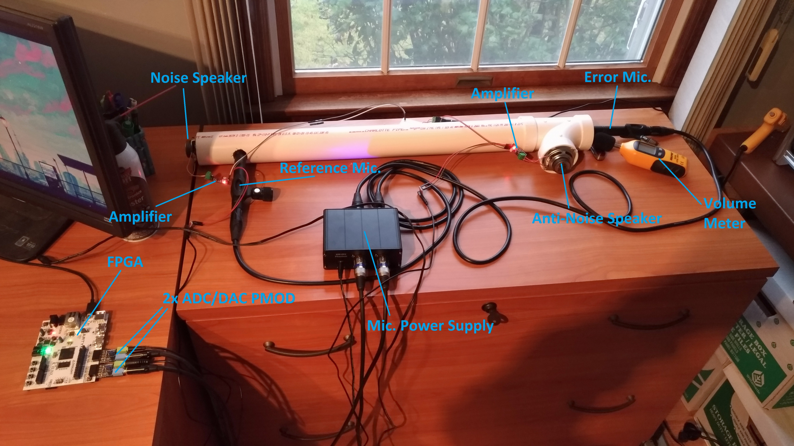
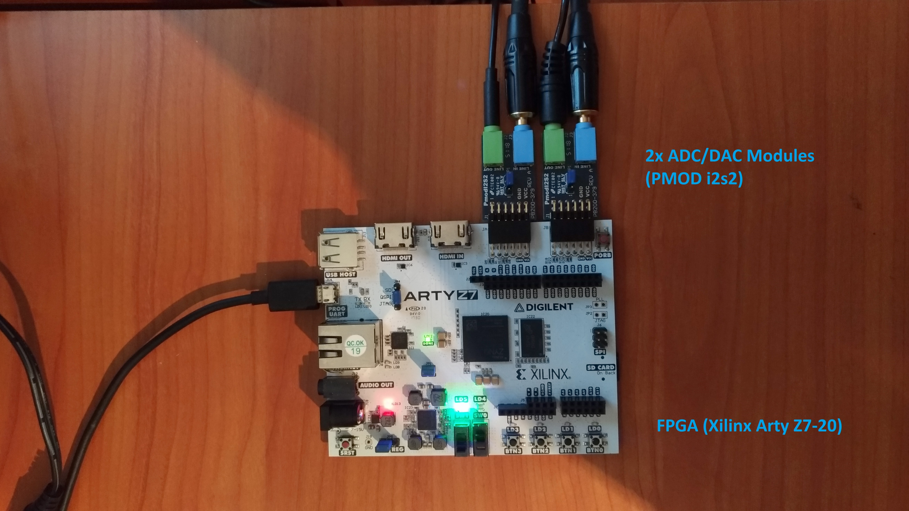
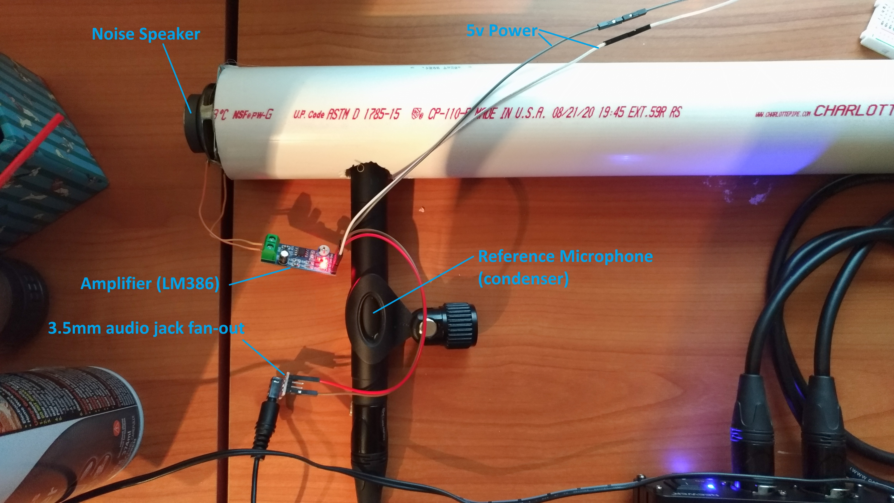
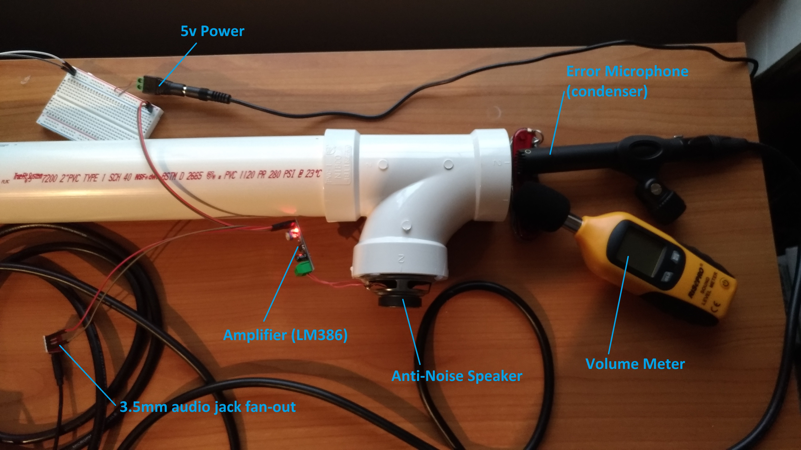
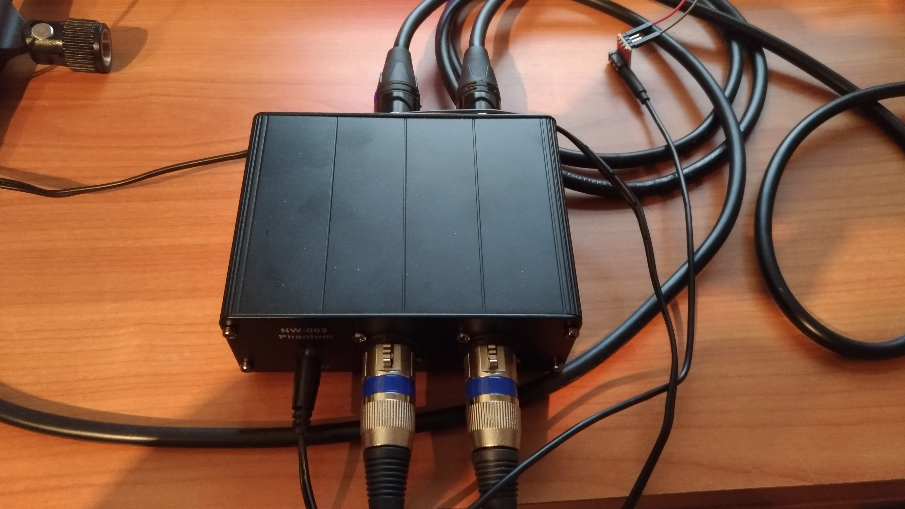

# ANC_System

NJIT Senior Design Project - Fall 2020 1st Place Finish
Team 9 - FPGA-based ANC System

We investigate active noise control solutions that are capable of attenuating a broad band of frequencies. The core objective of our project is to design and demonstrate an FPGA-based ANC system to attenuate undesired low frequency noise in HVAC air-ducts. Although ANC systems have been made before, we sought to develop a cost-effective FPGA-based version by creating hardware-efficient digital filters in VHDL.

A complete project report is included in the repository for further details.

Against a 150Hz + 225Hz noise source propagating through PVC pipe (3 inch diameter, 48 inch length) our ANC system is capable of learning and attenuating the noise at the opening of the PVC pipe from 85dBA to 67dBA after 40 seconds of adapting. Additional testing is due to find the band of frequencies for which our system is effective.

Photos of hardware:

